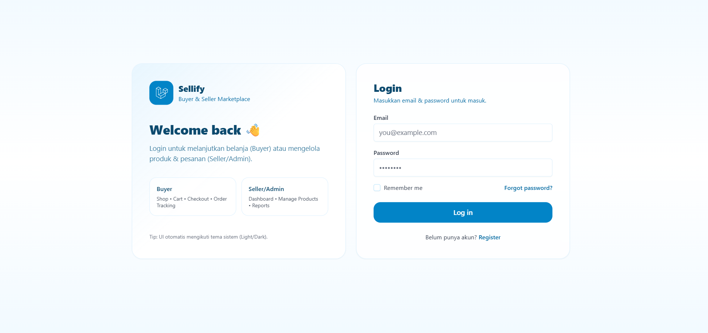
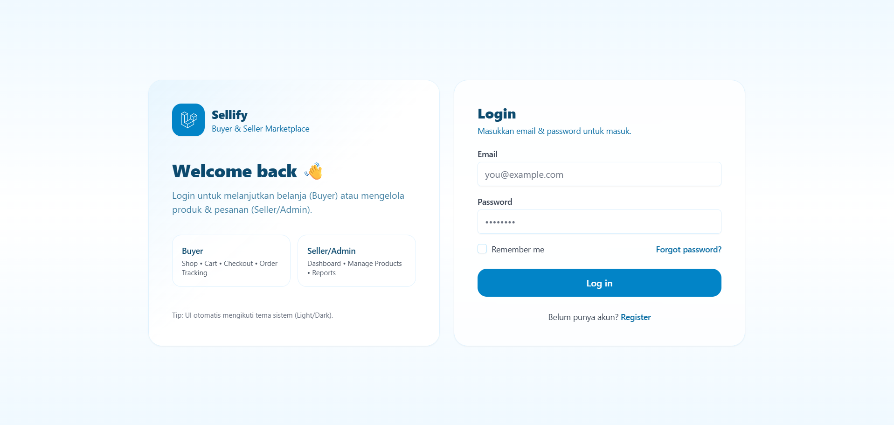
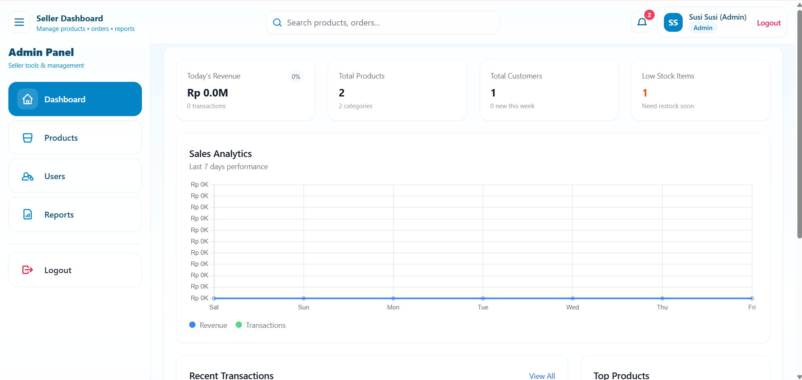
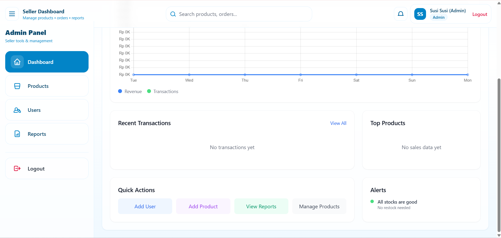
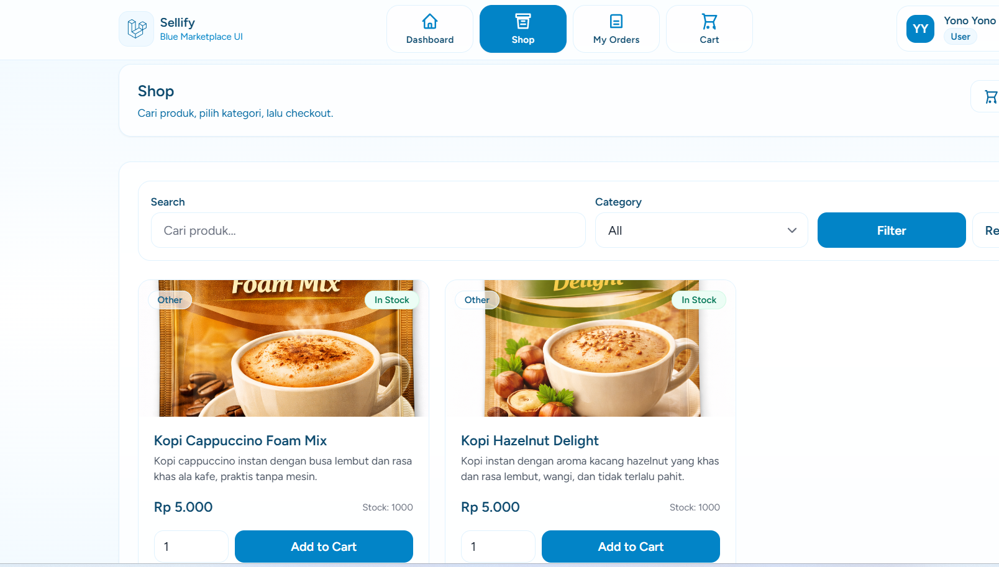
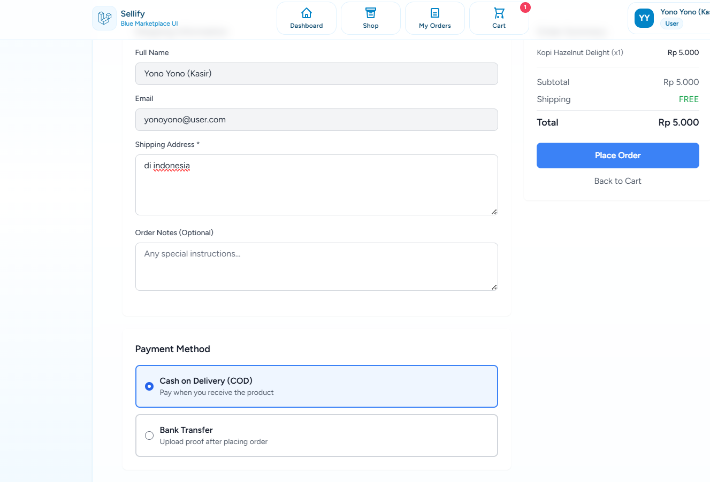
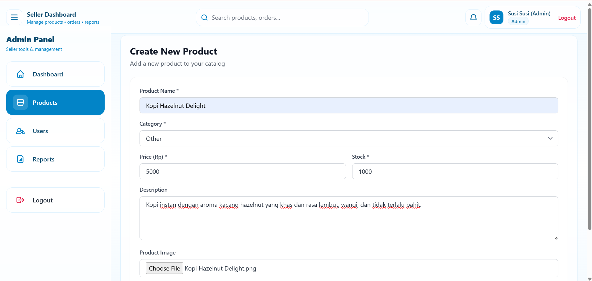
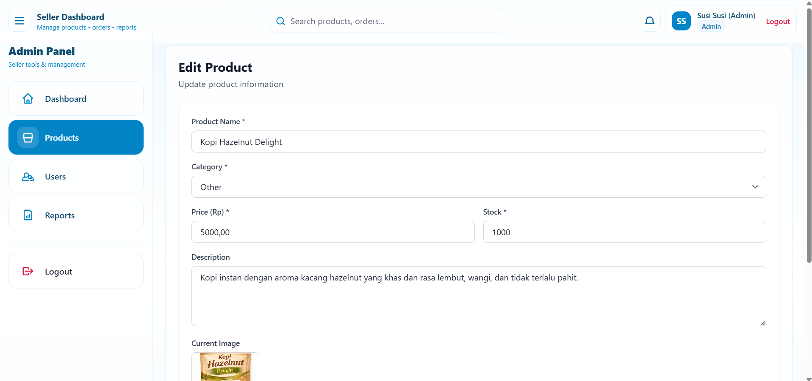
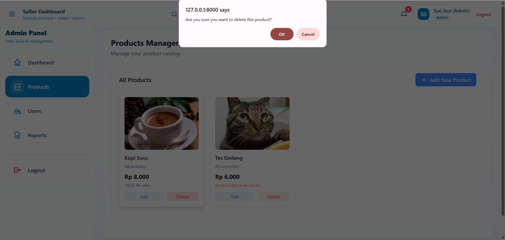

# 🛍️ Web Marketplace — E-Business Project

<div align="center">



### 🚀 Platform Marketplace Modern Berbasis Web  
**Mendukung Multi-Role User, Transaksi Digital, dan Manajemen Produk Terintegrasi**

<i>Proyek Mata Kuliah <b>E-Business</b></i>  
<i>Dikembangkan oleh <b>[Nama Kamu]</b></i>

<br>


</div>

---

## 📖 Deskripsi Proyek

**Web Marketplace** adalah aplikasi e-business berbasis web yang dirancang untuk memfasilitasi proses **jual beli online** secara efisien, terstruktur, dan modern.  
Sistem ini mendukung **multi-role user**, manajemen produk, transaksi digital, serta dashboard pengelolaan bisnis.

Proyek ini dibuat sebagai implementasi konsep **E-Business**, yang mencakup:
- Digital Commerce System
- Online Transaction Flow
- Business Process Automation
- Web-Based Information System

---

## ✨ Fitur Utama Sistem

Sistem marketplace ini memiliki beberapa role pengguna dengan hak akses yang berbeda.

### 🛡️ Admin Marketplace
- 📊 **Dashboard Analitik**  
  Monitoring total produk, transaksi, dan user.
- 📦 **Manajemen Produk**  
  CRUD produk lengkap dengan stok dan kategori.
- 👥 **Manajemen User**  
  Mengelola akun seller dan buyer.
- 🧾 **Laporan Transaksi**  
  Riwayat transaksi marketplace.
- ⚙️ **Pengaturan Sistem**  
  Konfigurasi data dan pengelolaan platform.

---

### 🏪 Seller / Penjual
- 🛒 **Kelola Produk**  
  Tambah, edit, dan hapus produk toko.
- 📦 **Manajemen Stok**  
  Update stok produk secara real-time.
- 📈 **Monitoring Penjualan**  
  Melihat performa penjualan sendiri.
- 🧾 **Riwayat Pesanan**  
  Daftar pesanan dari pembeli.

---

### 🧑‍💻 Buyer / Pembeli
- 🔍 **Jelajah Produk Marketplace**
- 🛍️ **Keranjang Belanja**
- 💳 **Checkout & Transaksi**
- 📜 **Riwayat Pembelian**
- ⭐ **Pengalaman Belanja Responsif**

---

## 🖼️ Dokumentasi Tampilan Sistem

### 🔐 Autentikasi & Dashboard
<table width="100%">
  <tr>
    <td align="center" width="33%">
      
      <br><b>Halaman Login</b>
    </td>
    <td align="center" width="33%">
      
      <br><b>Dashboard Analytic</b>
    </td>
    <td align="center" width="33%">
      
      <br><b>Dashboard Seller</b>
    </td>
  </tr>
</table>

---

### 🛒 Marketplace & Transaksi
<table width="100%">
  <tr>
    <td align="center" width="50%">
      
      <br><b>Halaman Marketplace</b>
    </td>
    <td align="center" width="50%">
      
      <br><b>Checkout & Pembayaran</b>
    </td>
  </tr>
</table>

---

### 📦 Manajemen Produk
<table width="100%">
  <tr>
    <td align="center" width="33%">
      
      <br><b>Tambah Produk</b>
    </td>
    <td align="center" width="33%">
      
      <br><b>Edit Produk</b>
    </td>
    <td align="center" width="33%">
      
      <br><b>Hapus Produk</b>
    </td>
  </tr>
</table>

---

## 🧩 Alur Bisnis (Business Flow)

1. Seller menambahkan produk ke sistem
2. Produk tampil di halaman marketplace
3. Buyer memilih produk dan melakukan checkout
4. Sistem memproses transaksi
5. Stok produk diperbarui otomatis
6. Admin memantau seluruh aktivitas marketplace

---

## 🛠️ Sellify Stack & Engine

Proyek ini dibangun menggunakan teknologi modern dari ekosistem Laravel yang stabil dan scalable.

| Teknologi | Versi | Kegunaan |
|---------|-------|---------|
| **Laravel** | 12.x | Backend framework (MVC, routing, authentication) |
| **PHP** | 8.2+ | Bahasa pemrograman backend |
| **Blade Template Engine** | Built-in | Template engine untuk tampilan UI |
| **Eloquent ORM** | Built-in | Manajemen dan relasi database |
| **Tailwind CSS** | 3.x | Styling UI responsif & dark mode |
| **Alpine.js** | 3.x | Interaktivitas frontend ringan |
| **Vite** | Latest | Asset bundler (CSS & JavaScript) |
| **MySQL** | 8.0+ | Database utama |
| **SQLite** | Optional | Database alternatif (testing) |
| **Laravel Breeze** | Latest | Authentication scaffolding |
| **Heroicons (SVG)** | Built-in | Ikon UI aplikasi |

---

## ⚙️ Panduan Instalasi

### 1️⃣ Clone Repository
## ⚙️ Panduan Instalasi

```bash
# 1. Clone repository
git clone https://github.com/Ramadhaneasy/Ebussiness-KurniaRiskyRamadhani202311006
cd Ebussiness-KurniaRiskyRamadhani202311006

# 2. Install dependency
composer install
npm install

# 3. Konfigurasi environment
cp .env.example .env
php artisan key:generate

# 4. Setup database
php artisan migrate --seed

# 5. Jalankan aplikasi
npm run dev
php artisan serve
