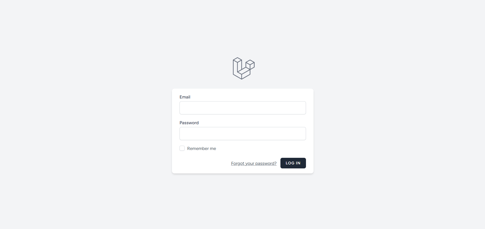
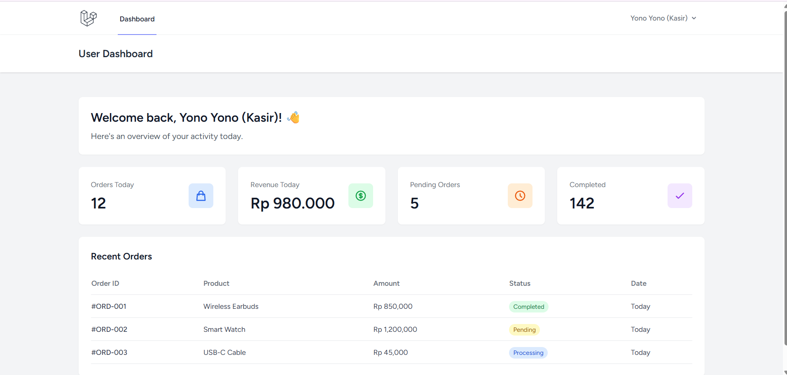
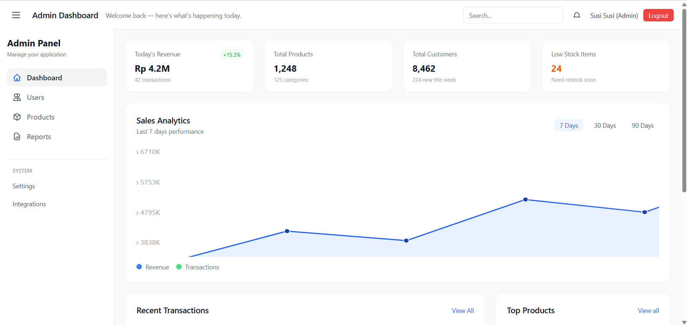
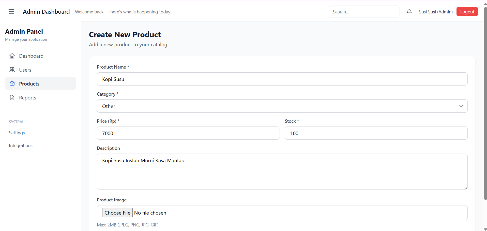
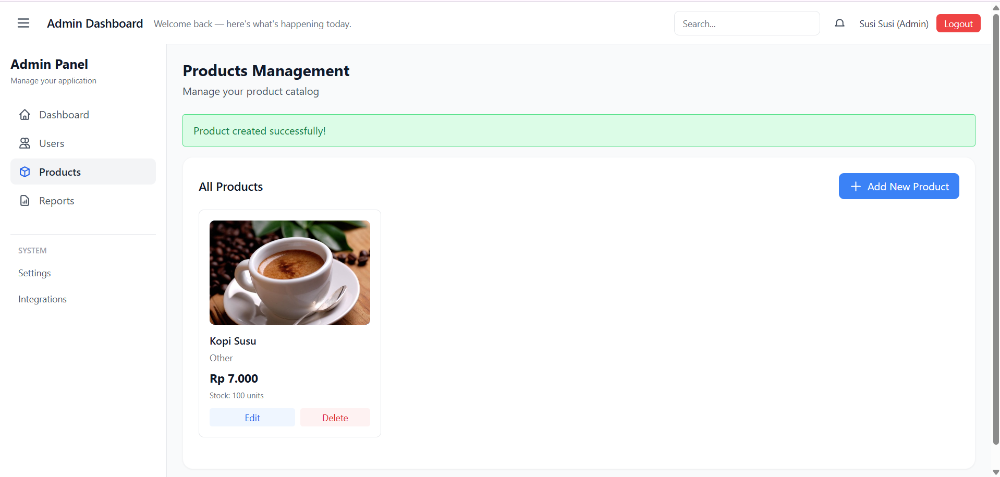
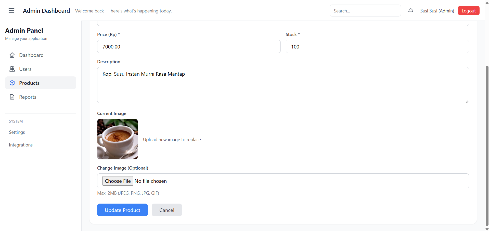
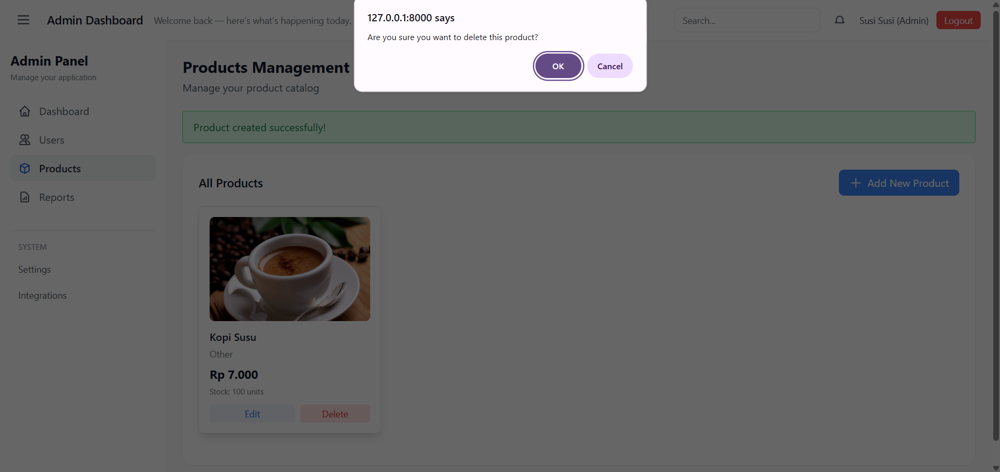
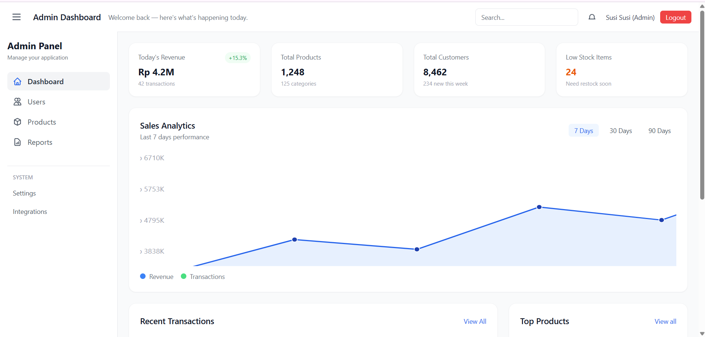
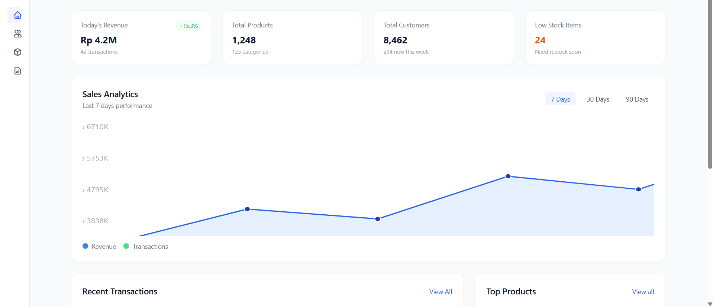
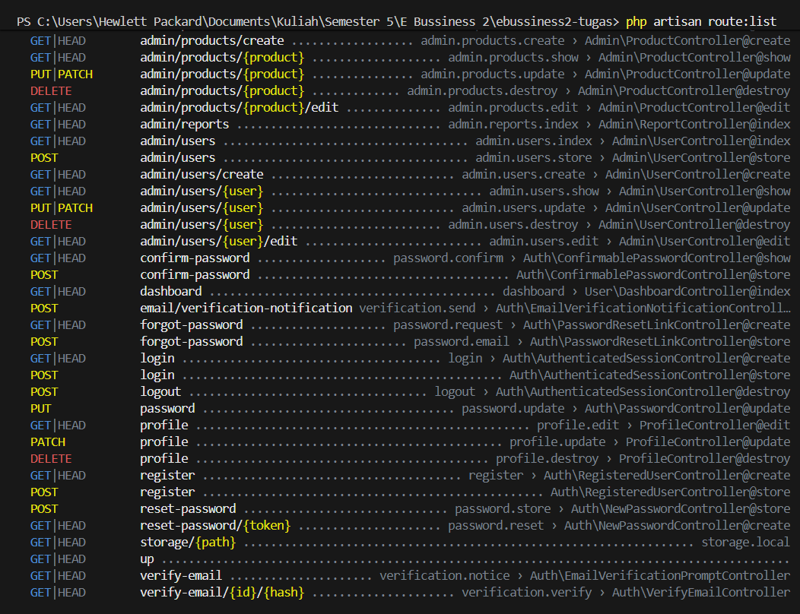

# 📝 Dokumentasi Tugas Laravel Ebusiness (RBAC)

Proyek ini mendokumentasikan implementasi sistem otorisasi berbasis peran (**Role-Based Access Control / RBAC**) pada aplikasi Laravel, sesuai dengan langkah-langkah tugas.

---

## ✅ Implementasi Role-Based Access Control (RBAC)

Berikut adalah ringkasan fitur utama yang telah diimplementasikan:

1.  **Instalasi Laravel Breeze:** Sistem login dan register dasar.
2.  **Kolom `role`:** Ditambahkan pada tabel `users` untuk membedakan `admin` dan `user`.
3.  **Middleware Admin:** Dibuat untuk memproteksi *route* `/admin`.
4.  **Route:**
    * `/dashboard` diakses oleh `user` biasa.
    * `/admin` hanya diakses oleh `admin`.

---

## 🔑 Akun Uji Coba

Akun yang digunakan untuk menguji hak akses (dibuat melalui Seeder):

| Peran | Email | Password |
| :--- | :--- | :--- |
| **Admin** | `susisusi@admin.com` | `susi123` |
| **User Biasa** | `yonoyono@user.com` | `yono123` |

---

## 🖼️ Tampilan Aplikasi

### 🔐 Halaman Login

Halaman *Login* standar yang disediakan oleh Laravel Breeze untuk autentikasi pengguna.

<div align="center">
  
</div>

---

### 👤 Dashboard User

Tampilan dashboard yang dapat diakses oleh **User Biasa** dengan role `user`.

<div align="center">
  
</div>

---

### 👨‍💼 Dashboard Admin

Tampilan dashboard khusus yang hanya dapat diakses oleh **Admin** dengan role `admin`.

<div align="center">
  
</div>

---

### 📦 Manajemen Product (CRUD)

Fitur Create, Read, Update, dan Delete untuk mengelola data produk.

<div align="center">
  <table>
    <tr>
      <td align="center">
        <br>
        <b>Create Product</b>
      </td>
      <td align="center">
        <br>
        <b>Read Product</b>
      </td>
    </tr>
    <tr>
      <td align="center">
        <br>
        <b>Update Product</b>
      </td>
      <td align="center">
        <br>
        <b>Delete Product</b>
      </td>
    </tr>
  </table>
</div>

---

### 📱 Sidebar Navigation

Tampilan responsif sidebar dalam mode expanded dan collapsed.

<div align="center">
  <table>
    <tr>
      <td align="center">
        <br>
        <b>Sidebar Expanded</b>
      </td>
      <td align="center">
        <br>
        <b>Sidebar Collapsed</b>
      </td>
    </tr>
  </table>
</div>

---

### 🛣️ Route List

Hasil perintah `php artisan route:list` yang menunjukkan middleware `admin` telah berhasil diterapkan pada route `/admin`.

<div align="center">
  
</div>

---

## 🚀 Cara Menjalankan
```bash
# Clone repository
git clone <repository-url>

# Install dependencies
composer install
npm install

# Setup environment
cp .env.example .env
php artisan key:generate

# Migrasi dan seeding database
php artisan migrate --seed

# Jalankan aplikasi
php artisan serve
npm run dev
```

---

## 📄 Lisensi

Proyek ini dibuat untuk keperluan pembelajaran dan tugas kuliah.

---

**Dibuat oleh: [Kurnia Risky Ramadhani]**